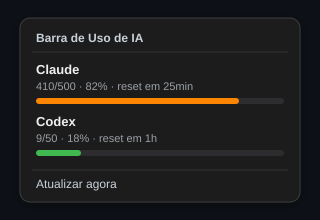

<div align="center">


# Barra de Uso de IA

**App de bandeja / barra de menu que mostra, em tempo quase real, quanto você já consumiu das suas cotas de Claude e Codex.**


</div>

---

## ✨ O que faz

A Barra de Uso de IA vive discretamente na bandeja do Windows e responde a uma
pergunta simples: **"quanto da minha cota eu já gastei?"** — sem abrir o navegador
nem fazer login dentro do app (basta ter os CLIs `claude`/`codex` já autenticados),
sem sair do fluxo de trabalho.

- 📊 **Barra visual de consumo** por provider, com cor que muda conforme o uso
  (verde → amarelo → laranja → vermelho).
- 🕒 **Tempo até o reset** da janela de cota (ex.: *reset em 25min*).
- 🔄 **Atualização automática** a cada 10 minutos + botão **Atualizar agora**.
- 🪶 **Leve e silencioso**: roda no loop de eventos do Qt, sem janela principal.
- 🔒 **Seguro por design**: leitura *read-only* dos tokens; nada é logado ou enviado
  a terceiros (ver [SECURITY.md](SECURITY.md)).

> Inspirado no [akitaonrails/ai-usagebar](https://github.com/akitaonrails/ai-usagebar).
> Esta versão cobre **Claude** e **Codex**.

---

## 🖼️ Preview

<div align="center">



<sub><i>Ilustração do menu de contexto. As barras usam a paleta real do app.</i></sub>

</div>

> 💡 **Capturas reais:** salve seus próprios screenshots em
> `docs/images/menu.png` e `docs/images/tooltip.png` e troque o `preview.svg`
> acima por eles para documentar o app rodando na sua máquina.

---

## ⚙️ Como funciona

```
  ┌──────────────┐   read-only    ┌──────────────┐   HTTPS    ┌─────────────────┐
  │  CLIs oficiais│ ─────────────▶ │  credentials │ ─────────▶ │ endpoint de uso │
  │ claude/codex  │  (token OAuth) │   (memória)  │  Bearer    │ (Anthropic/OAI) │
  └──────────────┘                └──────────────┘            └─────────────────┘
                                          │                            │
                                          ▼                            ▼
                                   ┌──────────────────────────────────────┐
                                   │  SystemTray (PyQt6): tooltip + menu    │
                                   │  com barra colorida e tempo de reset   │
                                   └──────────────────────────────────────┘
```

1. **Credenciais** — o app lê (somente leitura) os tokens OAuth gravados pelos
   próprios CLIs:
   - Claude: `~/.claude/.credentials.json` — no **macOS**, se o arquivo não
     existir, cai automaticamente para o **Keychain** (serviço
     `Claude Code-credentials`), também em modo somente leitura.
   - Codex: `~/.codex/auth.json`

   No Windows, `~` corresponde a `%USERPROFILE%`; no macOS/Linux, ao seu home.
2. **Consulta de uso** — usa o token como `Bearer` para consultar os endpoints de
   uso de cada provider (em *worker* assíncrono, para não travar a UI).
3. **Apresentação** — converte a resposta em uma barra colorida + texto, no tooltip
   e no menu da bandeja. Em falha temporária, reaproveita o último valor válido
   (cache) com uma nota.

Se um token estiver **ausente ou expirado**, a UI orienta a rodar `claude login`
ou `codex login`.

---

## 🚀 Como rodar (desenvolvimento)

Requer **Python 3.11+**.

```bash
python -m pip install -r requirements.txt
python main.py
```

- **Windows:** o ícone aparece na bandeja. Clique com o botão direito para ver o
  menu com o uso de cada provider.
- **macOS:** o ícone aparece na **barra de menu** (canto superior direito).
  Em modo desenvolvimento (`python main.py`) pode aparecer também um ícone no
  Dock; o app empacotado (`.app`, abaixo) roda como agente e **não** mostra Dock.

---

## 🧪 Testes

```bat
python -m unittest discover -s tests -v
```

Os testes usam `unittest` da biblioteca padrão (também rodam com `pytest`).
Nenhum token real é usado — apenas *fixtures* fake em diretórios temporários.

---

## 📦 Build do app

### Windows — executável `.exe`

```bat
build.bat
```

Gera um pacote portátil via PyInstaller. A saída final fica **fora** da pasta do
Google Drive (em `C:\tmp\BarraUsoIA_*`), porque a pasta sincronizada pode bloquear
a criação do `.exe`.

### macOS — app `.app`

Instalação em um comando (cria venv, instala dependências, gera e instala o app
em `/Applications`):

```bash
bash install-mac.sh
```

Ou só gerar o `.app` (fica em `dist/BarraUsoIA.app`):

```bash
bash build.sh
```

O `build.sh` usa PyInstaller (`--windowed`) e marca o app como agente da barra de
menu (`LSUIElement`), então ele roda **sem ícone no Dock**. Se não houver
`assets/icon.icns`, o script o gera a partir de `assets/icon.png` com `sips`/`iconutil`.

Depois de instalar: `open -a "BarraUsoIA"` (ou abra pelo Finder). O ícone aparece
na barra de menu.

---

## 🔒 Segurança & privacidade

- **Read-only:** o app nunca escreve, renova ou apaga os arquivos de credencial.
- **Tokens só em memória:** nunca logados, nunca persistidos, nunca em mensagens
  de erro.
- **Sem segredos no repositório:** não há `.env` nem chaves versionadas; o
  `.gitignore` bloqueia esses padrões por precaução.
- **`OPENAI_API_KEY` ignorada de propósito:** apenas o token OAuth do Codex é
  aceito (ver detalhes em [SECURITY.md](SECURITY.md)).

---

## 🗺️ Limitações e roadmap

- **Endpoints não documentados:** `api.anthropic.com/api/oauth/usage` e
  `chatgpt.com/backend-api/wham/usage` podem mudar sem aviso. O parsing é
  tolerante; valide o schema real antes de confiar 100% nos números.
- **Fora do escopo atual:** refresh automático de token, janela de detalhes/gráficos,
  histórico, alertas de limite, suporte a GLM/OpenRouter/DeepSeek, múltiplas
  contas e instalador.
  
---

## 📄 Licença

Distribuído sob a licença [MIT](LICENSE). © 2026 Paulo Bidu.
